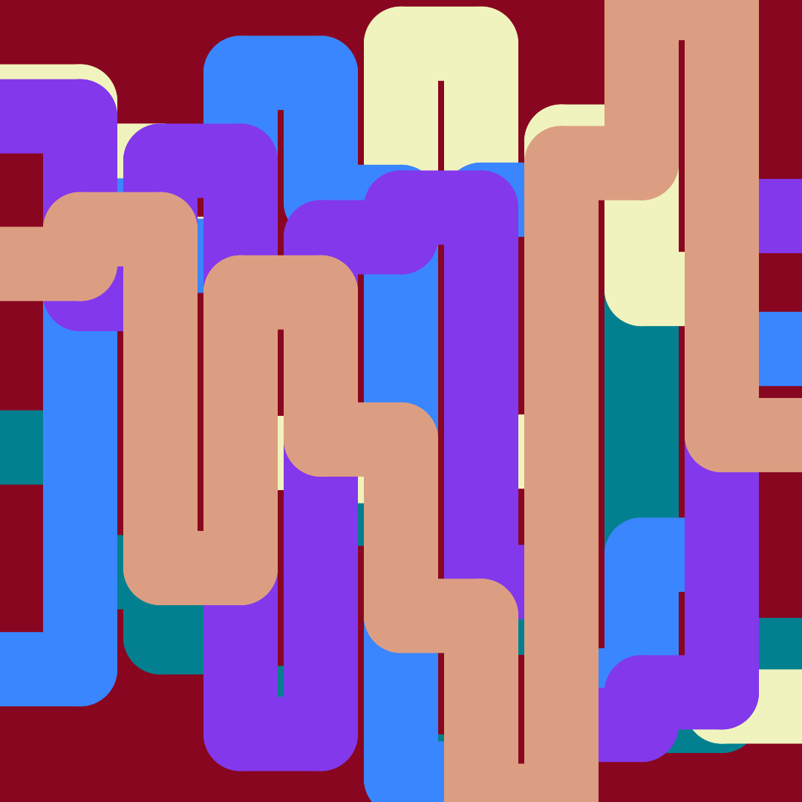
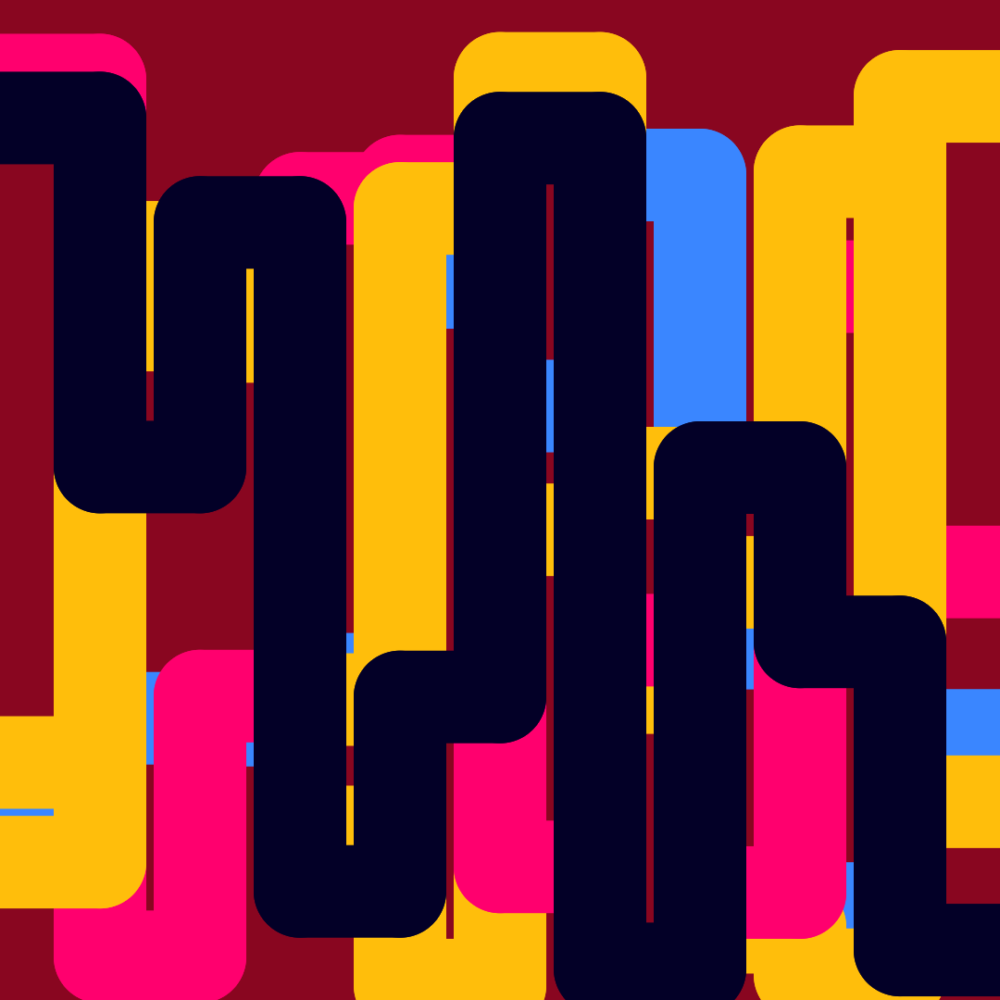

# Lines Art
IG: @dede.artbit
This small tool can be used to create line art (examples below).
It uses P5.js to draw 3 kinds of lines: segments, broken lines and broken bezier lines.
It was made just to generate this kind of art, so for this reason it is not very flexible, in any case it can be used freely.

